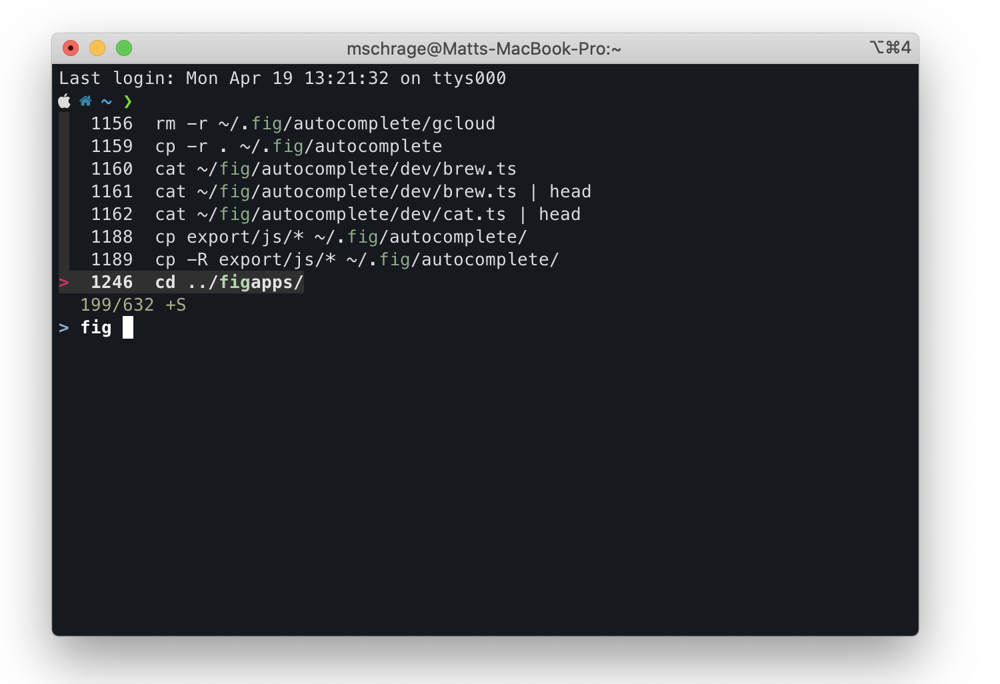

### Building `fzf` style history search with Fig



##### Overview

An often overlooked terminal shortcut is *history search*. Pressing `control`+`r`, let's you quickly search over all of your previously used terminal commands. We would like you to implement this history search functionality but as a Fig app.


##### Stack:

| Framework | Language   |
| --------- | ---------- |
| Vue2      | Typescript |


##### Goals:

1. Create a standard  Vue/TS development environment, with transpilation, module bundling, linting, etc 
2. Load command history, accounting for different shells (`bash`, `zsh`, `fish`), terminals, and history saving formats
3. Update list of commands to include new commands run by the user
4. Display and filter a list of suggestions based on what the user has typed

##### Stretch goals:

1. Implement fuzzy searching
2. Highlight fuzzy search matches

----


##### Barebones Setup

1. Run `python3 -m http.server 3000` in the root project folder

2. Switch to development build using  `fig util:build dev`

   

* When using a `dev` build, the Fig app will load a file from `localhost:3000/autocomplete/v6` in the popup window.

* You can switch builds by running `fig util:build <BUILD>`
  * To switch to `dev`, run `fig util:build dev`. To switch back to `prod`, run `fig util:build prod`

* We've included a very barebones starter (`./autocomplete/v6/index.html`), so you can get a sense for the Fig APIs and sanity check that everything is working. 

==You should set up a more standard Vue/TS development environment, with transpilation, module bundling, linting, etc.==

##### Debugging Tips

- You can press `escape` at anytime to hide the popup window. This is helpful if you need to run a command in the terminal.

- You can right click on the popup window to force it to reload and open the web inspector.

- If you want to force the popup window to appear (for instance, so that you can click on it to show the JS console), go to the Fig menubar icon  > Settings > Developer and then toggle "Debug Mode" on.

---


##### Relevant APIs

See `./autocomplete/v6/index.html` for sample implementation.


###### Initialization

Running fig.js commands before `fig.init` has been called results in undefined behavior. You should overwrite `fig.init` with your own function, that serves as the entry point for application logic.

```
fig.init = () => {
  console.log("fig.js has loaded and you can run fig commands")
  
  // you might initialize the pty here as well
  fig.pty.init()
}
```


###### Getting the Edit Buffer

```
fig.autocomplete = (buffer, cursorIndex) => {

}
```


###### Intercepting Keystrokes


While the Fig popup window is visible, it will intercept certain keystrokes.

- Enter  (`36`)
- Tab (`48`)
- Up arrow (`126`)
- Down arrow (`125`)

```
fig.keypress = (appleKeyCode) => {

}
```

###### Writing Files

```
await fwrite("~/path/to/file")
```

 This will write the file at `~/path/to/file` or throw an error. It is an async wrapper over `fig.fwrite`.

###### Reading Files

```
await fread("~/path/to/file")
```

 This will read the file at `~/path/to/file` or throw an error if the file does not exist. It is an async wrapper over `fig.fread`.

###### Running Shell Commands

```
await ptyexecute("git")
```

This will execute the command in a background pseudo terminal. It is an async wrapper over `fig.pty.execute`.

###### Setting the Window Height

```
fig.maxheight = `${100}`
```

> Note that the value assigned to `maxheight` must be a **string**.
